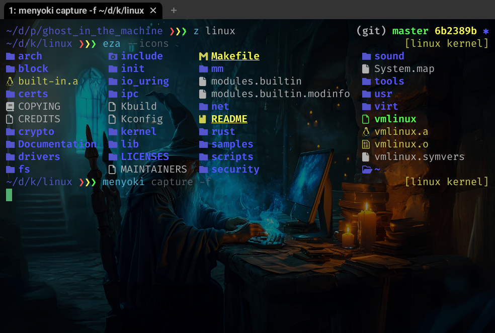

# 🐟🐧🐢 When Fish Prompt Meets the Linux Kernel (and Loses)

My Fish shell right prompt normally shows a tidy Git status: branch name, dirty marker, maybe ahead/behind arrows. It feels great—until you `cd` into the Linux kernel source tree. Then every keypress gets taxed while Fish waits for `git` to spelunk a gigantic repository. The prompt stops feeling instant and starts feeling like 2008 spinning rust.

So I taught the prompt to bail out early when I'm in the kernel directory.

## The Symptom

Inside `~/dev/kernel/linux` the right prompt lagged: noticeable pause before the next line appeared. Outside of it: buttery smooth.

Typical culprits for a slow Fish right prompt:

- Running full `git status` (porcelain) instead of lightweight plumbing
- Asking Git for stash / ahead / untracked counts every render
- Large `.git` directory with hundreds of thousands of objects / refs
- Prompt calling multiple separate Git commands serially

The Linux kernel repo is massive; even optimized helpers can hurt if called on every redraw (multi-line editing, completions, etc.).

## The Quick Fix (Early Return)

I added this guard near the top of `fish_right_prompt.fish`:

```fish
# Disable expensive git status in Linux kernel directory
set -l current_dir (pwd)
if string match -q "~/dev/kernel/linux*" "$current_dir"
   set -l cmd_status $status
   if test $cmd_status -ne 0
      echo -n (set_color red)"✘ $cmd_status"
   end
   echo -n (set_color yellow)" [linux kernel]"
   set_color normal
   return
end
```

Result: prompt latency in that directory dropped to “instant” again, because all the Git introspection code below this block simply never runs there.



### Why It Works

Fish renders the right prompt on every new command line. By returning early:

- No `git` processes spawn for that path.
- No filesystem crawls over `.git/` objects.
- No subshells waste cycles computing ahead/behind.

The string path check is effectively O(1) and cheaper than even a single `git rev-parse`.

## A Tiny Bit Safer (Symlinks / Canonical Path)

If you sometimes enter via a symlinked path, you can normalize first:

```fish
set -l current_dir (realpath (pwd) 2> /dev/null)
if string match -q "~/dev/kernel/linux*" "$current_dir"
   # ...same body...
end
```

## Alternatives & Enhancements

Pick whichever fits your setup:

1. Environment toggle: set an env var inside heavy repos:

   ```fish
   # In ~/.config/fish/conf.d/kernel-dir.fish
   if test (pwd) = "~/dev/kernel/linux"
       set -gx FISH_DISABLE_GIT_STATUS 1
   end
   ```

   Then wrap your git status code: `if not set -q FISH_DISABLE_GIT_STATUS; ... end`

2. Per‑repo Git config: Reduce Git cost instead of skipping entirely:

   ```bash
   git config --local status.showUntrackedFiles no
   git config --local fetch.prune true
   ```

   (Helps if your prompt only needs tracked changes.)

3. Use a fast status helper (e.g. `git status --porcelain=v2 -uno` once, cached). Cache the output in a universal variable with a short TTL using Fish's `commandline -t` trigger or a background job. More complexity; only worth it if you need status inside the kernel tree occasionally.

4. Match by marker file: Drop an empty `.prompt-heavy` file in any repo you want to skip and test for its presence instead of hardcoding a path:

   ```fish
   if test -f .prompt-heavy
       # short-circuit
       return
   end
   ```

5. Asynchronous Git: Some frameworks (Starship, Tide, etc.) run git queries async. If you switch to one of those, the lag becomes visual jitter instead of a blocking delay. Still, skipping for giant repos is simpler.

## Minimalism Wins

I opted for the hardcoded path. It's explicit, zero overhead, and I *always* want the kernel tree exempt. Anything more elaborate felt like premature optimization of the optimization.

## If You Want to Measure

You can approximate prompt cost by timing a subshell that only runs the right prompt function:

```fish
for i in (seq 1 5); time fish -c 'fish_right_prompt' >/dev/null; end
```

Compare before and after adding the early return (outside the kernel tree vs inside). Numbers will vary with SSD vs NVMe, filesystem cache warmth, etc.

## Takeaway

Big repo making your Fish prompt feel soggy? Don’t overthink it. Put a tiny conditional at the top, bail out, move on with your life. Optimization by omission is still optimization.

Until next shell tweak,
*Reboot Therapy exits early.*
