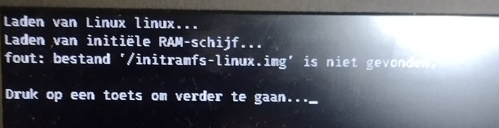
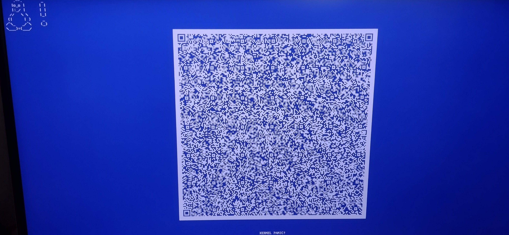

# 🐧🖥️💥 When Your Linux Kernel Panics on Boot: A Survival Guide

There’s nothing quite as jarring as powering on your Linux machine, only to be greeted by a kernel panic. A message comes up that the initial RAM filesystem (initramfs) can’t be found.



The system grinds to a halt by showing a BSOD!



This was new, in my earlier linux experiences, I had never encountered a BSOD. a gigantic QR-code that shows "19"? I don't like that at all!

## The first panic: I lost everything

When the kernel panics, your soul panics too.
Your machine freezes, your heart drops, and for a brief, painful second, you imagine every file you ever loved dissolving into entropy.

## The Second panic: Do I even have a bootable device?

Luckily, a dusty USB stick with “Arch Linux” scribbled on it still lived in a drawer.
Over a year old, half-forgotten — but like an old friend, it showed up when I needed it most.

### I'll fix this

1. Boot from the USB stick.
2. Try to remember the exact ritual for setting up an Arch Linux system. Fortunately, I had some cryptic scribbles on paper.

Set up the keyboard layout:

```bash
loadkeys be-latin1
```

Setup the terminal font:

```bash
setfont ter-124b
```

Connect to the internet (because misery loves company):

```bash
iwctl
  device list
  station <name> scan
  station <name> get-networks
  station wlan0 connect <ssid>
exit

ping archlinux.org
```

And suddenly — a terminal with internet access.
A small island of hope in an ocean of panic.

### Mount the partitions

Find out how your disks are laid out:

```bash
lsblk
```

Mount the root partition:

```bash
mount /dev/sdXn /mnt
```

Mount the EFI partition:

```bash
mount /dev/sdXn /mnt/boot/efi
```

Now peek inside:

```bash
ls /mnt/boot
```

Ah yes — vmlinuz-linux is there, but initramfs-linux.img is missing.
That’s like finding your shoes but no laces.

### Chroot into the system

Mount necessary filesystems:

```bash
mount -t proc /proc /mnt/proc
mount --rbind /sys /mnt/sys
mount --rbind /dev /mnt/dev
mount --rbind /run /mnt/run
```

Enter the chroot:

```bash
chroot /mnt /bin/bash
```

### Reinstall the kernel package

Because sometimes the only way forward is reinstalling reality:

```bash
pacman -S linux
```

### Regenerate initramfs

```bash
mkinitcpio -P
```

### Reconfigure grub

To make sure your bootloader still believes in you:

```bash
grub-install --target=x86_64-efi --efi-directory=/boot/efi --bootloader-id=GRUB
grub-mkconfig -o /boot/grub/grub.cfg
```

### Exit chroot and reboot

```bash
exit
umount -R /mnt
reboot
```

And then… it boots.
Against all odds, against entropy itself — my system lives again.
I exhale. I swear I’ll start doing backups. I won’t.

### System investigation

Now that my system is back up, I need to investigate why the initramfs went missing in the firNow that resurrection is complete, it’s time for forensics.
Why did the initramfs vanish in the first place?
Bad update? Corrupted disk? Cosmic punishment?

After digging through logs and pacman history, nothing.
No clue. Just silence.

Then a thought:
When updating the kernel, mkinitcpio removes and recreates the initramfs in /boot.
If /boot wasn’t mounted at that time, the initramfs would be created in the root filesystem instead of the boot partition.

Was /boot even mounted during the update?

```bash
❯❯❯ lsblk -f | grep boot
├─nvme0n1p1 vfat   FAT32 BOOT  8C2E-16C1                             572,8M    44% /boot

```

FAT32 filesystem... maybe not the best choice for a boot partition?

```bash
❯❯❯ sudo fsck -n /dev/nvme0n1p1

'fsck' uit util-linux 2.41.2 
fsck.fat 4.2 (2021-01-31) 

There are differences between boot sector and its backup. This is mostly harmless. 
Differences: (offset:original/backup) 65:01/00 Not automatically fixing this. 
Dirty bit is set. Fs was not properly unmounted and some data may be corrupt. 
Automatically removing dirty bit. Leaving filesystem unchanged. 
/dev/nvme0n1p1: 487 files, 115000/261628 clusters
```

**BAM !**

There it is! my boot partition wasn't properly unmounted at some point. I have to admit that I was not being careful while experimenting with some memory intensive software I won't mention here, resulting in random system crashes and freezes lately. This could have led to the loss of the initramfs during a system update. FAT32 is not journaled, so unflushed writes (like when mkinitcpio writes the initramfs) can *vanish silently* if the FS wasn't synced properly.

### Probable sequence of events

1. System update initiated.
2. /boot was mounted, everything looks fine.
3. System or pacman **hung or crashed** mid-write.
4. FAT32 silently drops the incomplete write
5. Next reboot -> kernel panic. Missing initramfs. Existential dread.

## Preventing future issues

### Verify /boot is mounted before touching the kernel, by adding a initcpio hook

```bash
nvim /etc/initcpio/hooks/check_boot_mount

#!/bin/bash

run_hook() {
 [[ -d /boot/EFI ]] || {
   echo "⚠️  /boot not mounted — aborting initramfs build."
   exit 1
 }
}

sudo chmod +x /etc/mkinitcpio.d/hooks/check_boot_mount
```

```bash
nvim /etc/initcpio/install/check_boot_mount

#!/bin/bash

build() {
 add_runscript
}

help() {
 echo "check_boot_mount: no-op custom hook"
}

sudo chmod +x /etc/mkinitcpio.d/install/check_boot_mount
```

### Add the hook to the mkinitcpio configuration

```bash
nvim /etc/mkinitcpio.conf
HOOKS=(... check_boot_mount ...)
```

### Consider a Journaled Filesystem for /boot

Switch to ext4 to reduce the risk of data loss during unclean shutdowns.
This is something I plan to do in the future, but it requires some partition resizing and data migration, so I'll tackle that when I have more time.

### Create a custom bootable arch linux rescue USB stick and keep it handy for future emergencies

Another one I plan to do, so I don't have to rely on an old installation USB stick next time.

## Conclusion

After all that, the system boots.
Life returns to normal — or as normal as it gets for an Arch user who just spent hours rebuilding their boot environment by hand.

Backups, journaling, verification hooks — lessons learned (and likely forgotten).

Because let’s face it: this won’t be the last panic.
Just the most educational one.
