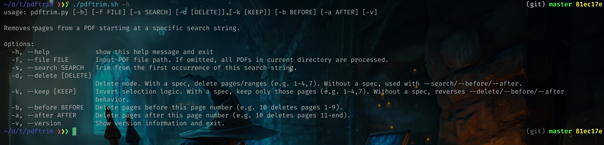

# ✂️📄 PDFTrim: From Tiny Hack to Full-Fledged PDF Assassin

Sometimes a tiny script is just a virus in disguise.  
That’s how **PDFTrim** came to be — a one-day “vibe-coded” utility that refused to stay small and grew teeth.  

You know the situation: hundreds of PDFs, some sprawling 300 pages, some hiding blank pages like landmines, and your patience evaporating with every scroll. Existing tools? Too slow, too heavy, too bloated, too much learning. So I did what any sane terminal-bound human would do: **I built my own**.

---

## The Origin Story: One-Day Hack

It started as:

> “Write a script to remove pages that come after a given string from a bunch of pdf's. Quick.”

Vibe coding is the dev's superpower if it comes to automation... and sheer laziness.

It worked… mostly. Sometimes it didn’t. But hey, a working prototype is what we all need to feel like a god.

---

## Evolution: Growing Teeth

PDFTrim refused to stay a “tiny hack.” Over time, it gained superpowers:

- Explicit page ranges for laser-precise extraction  
- Automatic blank page detection and removal  
- Clean architecture (because spaghetti scripts make me cry in the dark)  
- CLI flags for batch processing dozens of files at once  

What began as a quick hack became a **nimble, practical, barely-bloated PDF killer**.  

---

## Usage: Quick, Brutal, Effective

Trim a PDF in seconds:

```bash
pdftrim -f input.pdf -s "Foto's"
```

Batch dozens of PDFs? One loop, and PDFTrim devours them **like a hungry predator in a library - in the blink of an eye.**



### Why I made It?

- Because manually selecting pages in +50 PDF's is soul-crushing
- Because deleting blank pages by hand is a crime against humanity
- Because fast, maintainable, no-bloat CLI tools are a rare breed - like unicorns
- Because if I can automate PDF hell, I can automate anything - **YES I CAN!**

### The Code

For those brave enough to peer into the abyss:
[PDFTrim on GitHub](https://github.com/ChristofBecu/pdftrim)

### TL;DR

PDFTrim: started as a tiny vibe-coded script, now a lean, mean, PDF-processing machine — trims pages, nukes blanks, handles batches, and even reverses PDFs — all without the bloat, leaving you feeling like a slightly unhinged terminal wizard.
